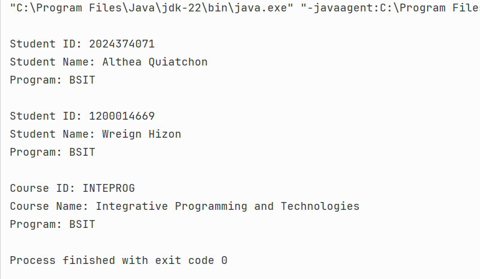
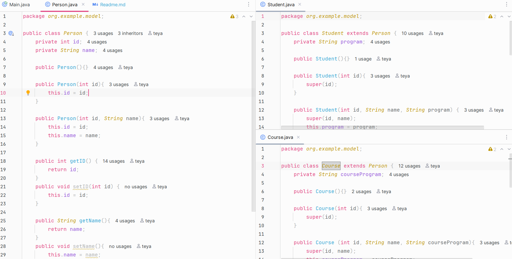
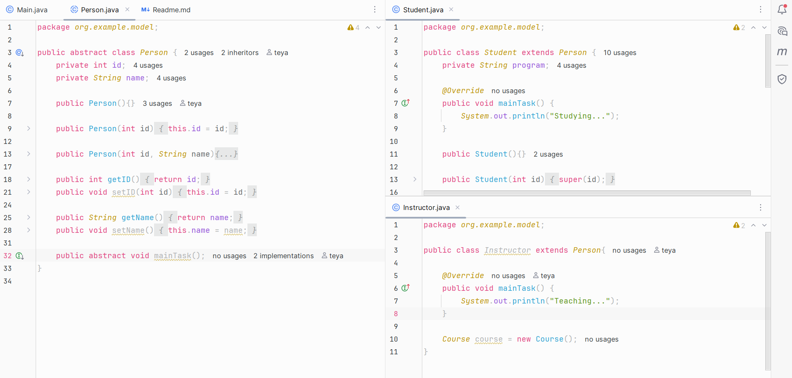

# OOP Enrollment System

---
**Author**: Althea Quiatchon

**1.Encapsulation**: Classes *Student* and *Course* were made using a provided UML
to practice the Access Modifiers and Getters/Setters.

---
**2. Inheritance**:
- Turned *Person* to a *superclass*.
- Turned *Student* and *Instructor* to *subclasses*.

---
**3. Abstraction**: Established *Person* as an abstract class with *Main Task* as its abstract method.
Defined *Student*'s specific main task as "*Studying*."
Defined *Instructor*'s specific main task as "*Teaching*."

